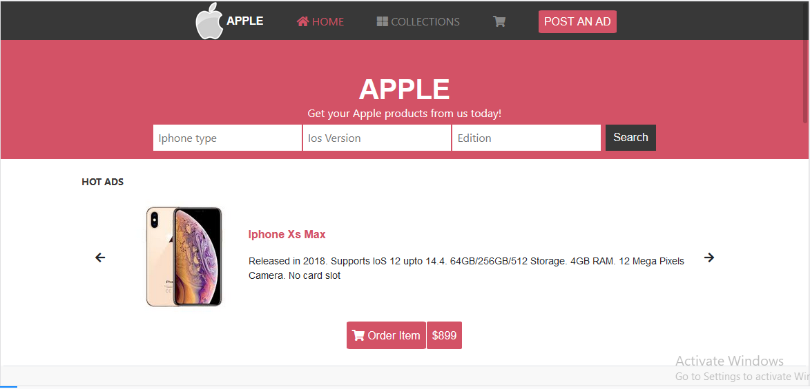
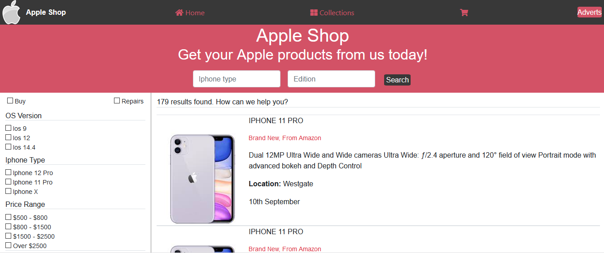

# Apple-Shop

First Capstone Project

Additional description about the project and its features.

This is a project to demonstrate the existing knowledge of HTML and CSS. It is a Solo project of a mobile (Apple) shop

<i>Built With HTML5, CSS3, GIT, Bootstrap, SASS and VSCODE</i>

Live Demo : [The-livedemo-link](https://karvel-code.github.io/Microverse-Capstone/index.html)

<h1>Getting Started</h1>

To get a local copy up and running follow these simple example steps.

1. Go to https://karvel-code.github.io/Microverse-Capstone/index.html
2. Click on code and copy the html code.
3. Use git bash to clone this repository on your local machine.
4. Run git checkout -b your-branch-name Make your contributions
5. Push your branch up to your forked repository
6. Open a Pull Request with a detailed description to the development branch of the original project for a review

Prerequisites Text editor, Github profile and Git.

<h2>Author</h2>

👤 Elvis (Karvel) Kariithi Gitinji

- Github: [@karvel-code](https://github.com/karvel-code)
- Linkedin: [Elvis Kariithi](https://www.linkedin.com/in/elvis-kariithi-b6b5b31b6/)
<h2>
🤝 Contributing 
</h2>
Contributions, issues and feature requests are welcome!

Feel free to check the issues page.

Show your support Give a ⭐️ if you like this project!

📝 License This project is a collaboration project of microverse students. All rights are reserved for Elvis (Karvel) Kariithi Githinji
